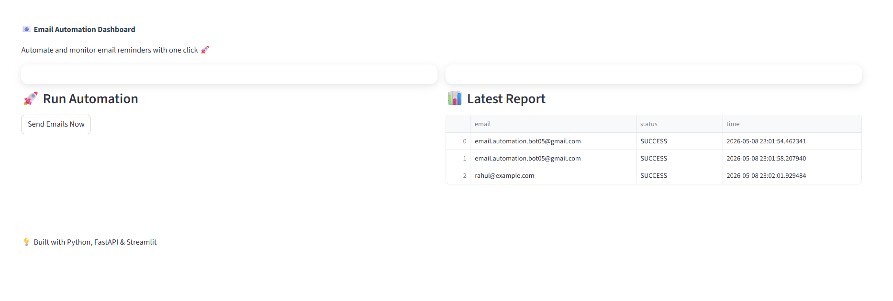
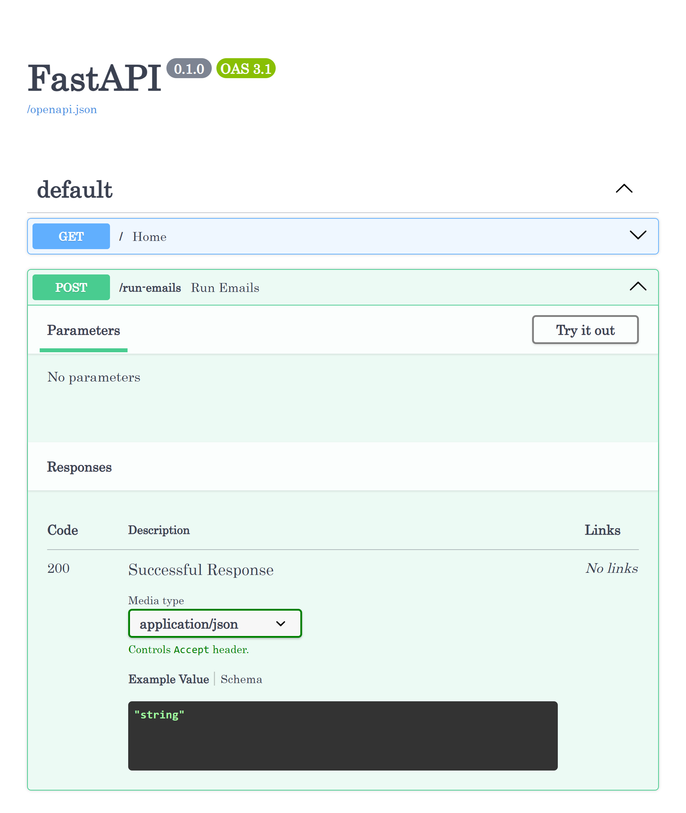
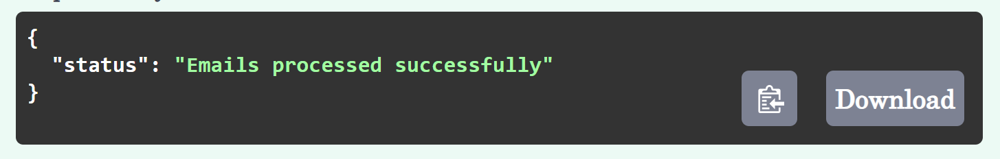

## 📧 Email Automation System

A full-stack Email Automation System built using Python, FastAPI, and Streamlit that allows users to send automated email reminders with a single click.

---

## 🚀 Features

- 📩 Automated email sending
- ⚡ FastAPI backend (REST API)
- 🎨 Streamlit interactive dashboard
- 📊 CSV-based reporting system
- 📝 Logging support
- 📁 Clean project structure

---

## 🛠️ Tech Stack

- Python
- FastAPI
- Streamlit
- Pandas
- SMTP (Email Sending)

---

## 📂 Project Structure
```

Email-Automation-System/
│
├── api.py
├── app.py
├── main.py
├── email_template.txt
├── requirements.txt
│
├── data/
├── outputs/
│   └── report.csv
│
├── images/

```
---

## ▶️ How to Run

1️⃣ Install Dependencies
```
pip install -r requirements.txt
```
---

2️⃣ Run FastAPI Backend
```
uvicorn api:app --reload
```
Open:
http://127.0.0.1:8000/docs

---

3️⃣ Run Streamlit UI
```
streamlit run app.py
```
---

## 📸 Screenshots

### 🎨 Dashboard UI

 

### ⚡ FastAPI Swagger

 

### ✅ API Execution

 


---

## 📌 Output

- Emails are sent automatically
- Report generated in:

(outputs/report.csv)

---

## 💡 Future Improvements

- Database integration (SQLite/PostgreSQL)
- Authentication system
- Email scheduling
- Cloud deployment

---

## 👩‍💻 Author

Nidhi Apotikar

---
